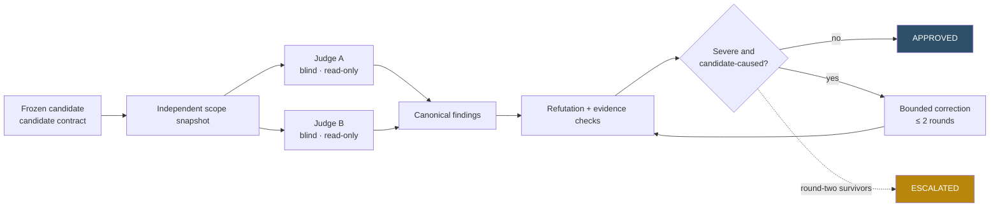
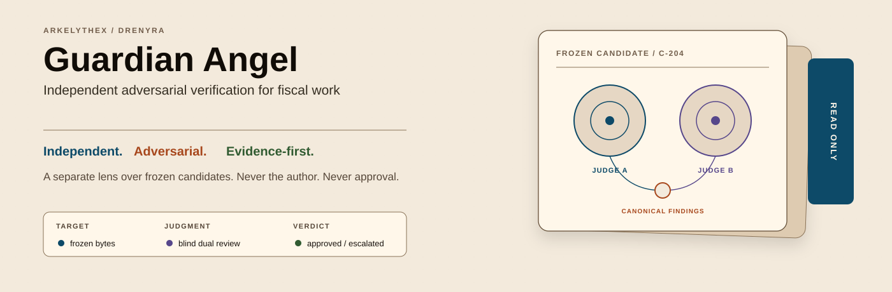
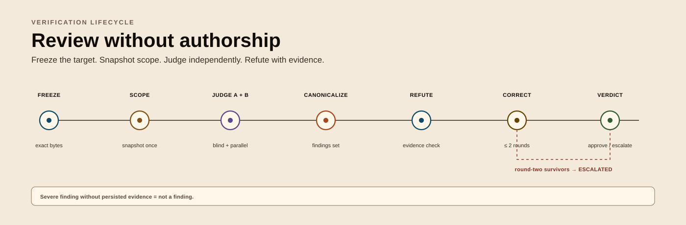
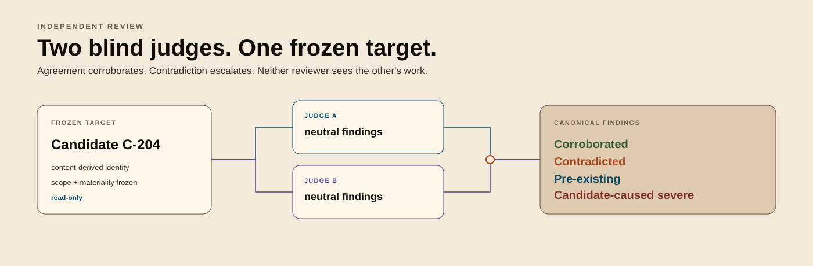
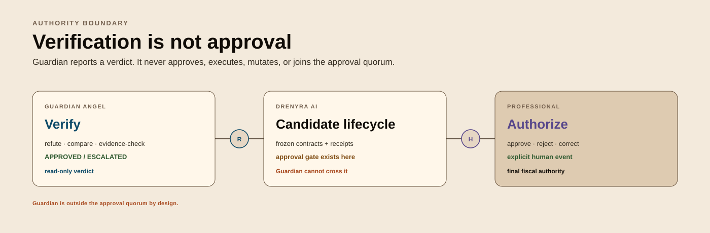

# Drenyra Guardian Angel

**Independent, adversarial, continuous verification for fiscal work** — the ecosystem's separate review lens. It verifies accounting candidates and receipts against the published `drenyra-ai` contracts, and it is **never the author of what it reviews**.

> [!IMPORTANT]
> **In development — public source repository.** This repository is publicly
> visible on GitHub as part of the Drenyra open-core transition intention. There
> are **no releases yet**: the verification tooling is being built under
> [SDD-090](https://github.com/arkelythex/drenyra-ai/tree/main/openspec/programs/drenyra-dominion/sdds/sdd-090-guardian).
> Distribution of artifacts and commercial services remains contractual, never
> public. Use, copy, and distribution of source remain governed by the
> [LICENSE](LICENSE) (proprietary, © Arkelythex).

## What It Does

The Guardian Angel is the fiscal-domain counterpart of
[`gentleman-guardian-angel`](https://github.com/Gentleman-Programming/gentleman-guardian-angel) —
same posture (independent reviewer, never the author), stricter controls
(fiscal risk is not a merge conflict). It **verifies adversarially** —
refutation, blind dual review, evidence checks — and it **never performs fiscal
approval**: approval is an explicit human/R2/R3 event recorded in the candidate
lifecycle.

It consumes the **frozen contracts** of
[`drenyra-ai`](https://github.com/arkelythex/drenyra-ai) (`candidate`, `receipt`,
`gate`, `ledger`, `recovery`) as its public surface — published versions, never
private internals — and brand assets follow the `brand-system` contract.

| Posture | Meaning |
| --- | --- |
| **Independent** | Never the author of what it reviews; a separate lens over the same frozen surface |
| **Adversarial** | Seeks refutation, not confirmation — candidate-caused severe findings block; pre-existing/base findings become follow-ups |
| **Evidence-first** | Decides from persisted evidence and receipts, never from transcripts |
| **Fiscal-safe** | RUC/company/period scope enforced in every check; no data across RUCs without explicit context |
| **Never approval** | Not part of the approval quorum; never approves, executes, or mutates candidates |

## Quick Start — How a Verification Runs

> [!NOTE]
> The repository is in development: today it holds the brand source and this
> documentation set. The automated tooling that executes this lifecycle is
> being built under SDD-090; until it ships, this is the verification model the
> repository is being built to execute — and the model every future reviewer
> follows.

1. **Freeze the target.** A candidate arrives from the ecosystem against the frozen `candidate` contract (content-derived identity, scope, materiality). The exact bytes under review are frozen before any check starts.
2. **Snapshot the scope.** The reviewer resolves the verification scope — which contracts apply, which evidence is in scope — before launching any work. Scope does not change mid-review.
3. **Two blind judges, in parallel.** Two independent reviewers inspect the identical frozen target with identical criteria, each returning one neutral findings result. Neither sees the other's work; agreement is corroboration, contradiction escalates.
4. **Canonicalize findings.** Findings are frozen into a canonical set. Only candidate-caused severe findings block; pre-existing/base findings become follow-ups; WARNING/SUGGESTION findings stay informational.
5. **Refutation and evidence checks.** Every severe finding must cite its evidence — the persisted evidence and receipts that prove it. A finding without evidence is not a finding.
6. **Bound the correction.** At most two scoped fix/re-judgment rounds; re-judgment sees only the frozen findings and the fix delta. Round-two survivors escalate.
7. **Verdict.** `APPROVED` or `ESCALATED`. The verdict is reported; it never grants approval, authority, or delivery — approval is a separate, explicit human event.

### Verification model at a glance



## Ecosystem

| Project | Role | Status |
| --- | --- | --- |
| [Drenyra Command Center](https://github.com/arkelythex/drenyra-command-center) | Command Center — web application (consumes) | In development (public) |
| [Drenyra AI](https://github.com/arkelythex/drenyra-ai) | Verifiable core — contracts source | Alpha (v0.5.0) |
| [Drenyra Pi](https://github.com/arkelythex/drenyra-pi) | Pi-native harness (consumes, pinned) | Pre-alpha |
| [Drenyra Engram](https://github.com/arkelythex/drenyra-engram) | Institutional memory (informs, never authorizes) | Alpha (v0.2.1) |
| [Drenyra Skills](https://github.com/arkelythex/drenyra-skills) | Versioned accounting/tax knowledge (PE jurisdiction) | In development (public) |
| **Drenyra Guardian Angel** | Independent adversarial verification | **In development (public) — this repo** |

**Direction rule:** satellites (Command Center, Pi, Engram, Skills, Guardian
Angel) consume the published `drenyra-ai` contracts — never the reverse;
`drenyra-ai` never depends on them. The Guardian Angel consumes published,
versioned contracts, never a checkout or private internals.

**Authority model:** the Drenyra accounting database is transactional truth;
Engram is institutional memory (informs, never authorizes); AI receipts and the
ledger are execution proof (Ed25519-signed, append-only); the Guardian Angel is
independent verification; the **human accountant is the final authority**.

### Drenyra Dominion Program

The Guardian Angel is one vertical inside the
[Drenyra Dominion Program](https://github.com/arkelythex/drenyra-ai/tree/main/openspec/programs/drenyra-dominion),
the federated program master that fixes vision, authority, contracts,
dependencies, gates, and sequencing across every Drenyra repository.

| Program vertical | This repo's role |
| --- | --- |
| [SDD-090 — Guardian Angel](https://github.com/arkelythex/drenyra-ai/tree/main/openspec/programs/drenyra-dominion/sdds/sdd-090-guardian) | Independent, adversarial, strictly read-only verification over frozen candidates |
| [SDD-040 — Receipt-Driven Accounting v2](https://github.com/arkelythex/drenyra-ai/tree/main/openspec/programs/drenyra-dominion/sdds/sdd-040-rda-v2) | Provides frozen candidates with exact identity and evidence for review |

**Guardian doctrine:** strictly read-only over frozen candidates; never part of
the approval quorum; never approves, executes, or mutates candidates.

## Repository Structure

```text
assets/branding/BRAND.md     brand source + banner regeneration (brand-system v0.3)
docs/                        intended usage, codebase guide, architecture
LICENSE                      proprietary, © Arkelythex
```

The verification lenses and tooling land under `src/` as they are built
(SDD-090); nothing here executes yet.

## Brand

All assets follow the [brand-system](https://github.com/arkelythex/drenyra-ai/blob/main/contracts/brand-system.md)
contract (v0.3 DRAFT — Dreamcoder Light editorial surfaces with Anthracite Steel
dark variants). The Guardian Angel identity is a frozen candidate dossier under
independent review, not a literal shield or approval badge. The source direction
lives in [`assets/branding/BRAND.md`](assets/branding/BRAND.md).



<details>
<summary>Guardian Angel verification model</summary>







</details>

## Documentation

| Your task | Start here |
| --- | --- |
| Understand what this project is — and what it is NOT | [Intended Usage](docs/intended-usage.md) |
| Navigate the repository as a maintainer | [Codebase Guide](docs/CODEBASE-GUIDE.md) |
| Understand the ecosystem position and the verification model | [Architecture](docs/architecture.md) |
| Contribute | [CONTRIBUTING](CONTRIBUTING.md), [AI Policy](AI_POLICY.md) |

## Next Steps

- **New to the ecosystem?** Read [Intended Usage](docs/intended-usage.md) first — it defines the verification frontier and the responsibility split.
- **Understanding the design?** Read the [Architecture](docs/architecture.md) — ecosystem position, invariants, and the review lifecycle.
- **Maintaining this repository?** Use the [Codebase Guide](docs/CODEBASE-GUIDE.md) for where changes belong and what must never change.
- **Contributing?** Read [CONTRIBUTING](CONTRIBUTING.md) and the [AI Policy](AI_POLICY.md), then pick up an item from the [ROADMAP](https://github.com/arkelythex/drenyra-ai/blob/main/ROADMAP.md).

---

Proprietary. © 2026 Arkelythex. All rights reserved. See [LICENSE](LICENSE).
