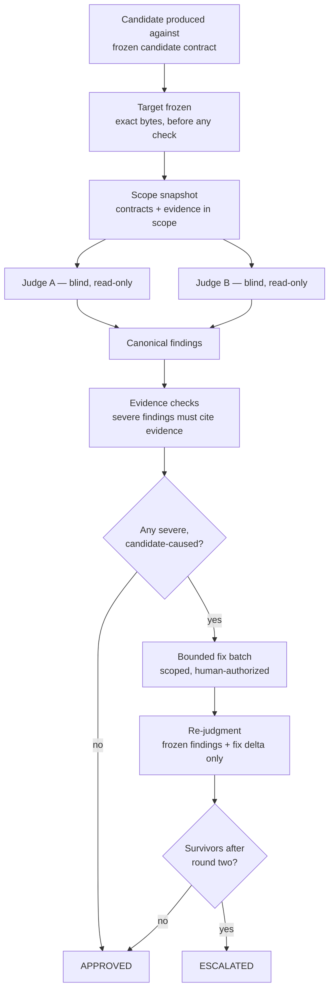

# Drenyra Guardian Angel — Architecture

> **Last updated:** 2026-08-19.

## Documentation index

| Doc | What it covers | Read when |
| --- | --- | --- |
| [Intended Usage](intended-usage.md) | The frontier: what the Guardian Angel is and is NOT | Starting out — read this first |
| [Architecture](architecture.md) | Ecosystem position, invariants, verification model, review lifecycle | Understanding the design (this doc) |
| [Codebase Guide](CODEBASE-GUIDE.md) | Repository map, layering, invariants, where changes go | Navigating or changing the repository |
| [README](../README.md) | Project overview at the ecosystem quality bar | First contact |
| [CONTRIBUTING](../CONTRIBUTING.md) | Contribution workflow and conventions | Contributing |
| [AI Policy](../AI_POLICY.md) | AI-assisted contribution rules | Contributing with AI assistance |
| [Drenyra AI Contracts](https://github.com/arkelythex/drenyra-ai/tree/main/contracts) | The frozen public surface this repository consumes | Verifying anything |

## Position in the ecosystem

```text
                    ┌───────────────────────┐
                    │  Drenyra Command Center│  professionals' interface (consumes)
                    └───────────┬───────────┘
                                ▼
              ┌─────────────────────────────────┐
              │            Drenyra AI           │  frozen contracts (Alpha v0.5.0)
              │  candidate · receipt · gate ·   │  Ed25519-signed receipts,
              │  ledger · recovery · brand      │  append-only ledger
              └───────────┬─────────────────────┘
                          │  published, versioned contracts
                          ▼
        ┌───────────────────────────────────────┐
        │      Drenyra Guardian Angel (this)    │  independent verification
        │  refutation · blind dual review ·     │  never the author, never approval
        │  evidence checks · two-round rule     │
        └───────────────────────────────────────┘
```

**Direction rule:** satellites — Command Center, Pi, Engram, Skills, and the
Guardian Angel — consume the published `drenyra-ai` contracts; `drenyra-ai`
never depends on them, and no satellite depends on another satellite's
internals. The Guardian Angel consumes published, versioned contracts — never a
checkout and never private internals.

**Authority model:** the Drenyra accounting database is transactional truth;
Engram is institutional memory (informs, never authorizes); AI receipts and the
ledger are execution proof (Ed25519-signed, append-only); the Guardian Angel is
independent verification; the **human accountant is the final authority**. The
Guardian Angel verifies the middle of this chain and never participates in the
end of it.

**Program:** this repository is one vertical of the [Drenyra Dominion Program](https://github.com/arkelythex/drenyra-ai/tree/main/openspec/programs/drenyra-dominion),
governed by SDD-090 (independent, adversarial, strictly read-only verification
over frozen candidates) and fed by SDD-040 (frozen candidates with exact
identity and evidence). Full specs live in the program master — never copied
here, because they would diverge.

## Core invariants

1. **Independence.** The reviewer is never the author of what it verifies — a separate lens over the same frozen surface.
2. **Read-only doctrine.** The verification target is frozen before any check; nothing is mutated, executed, or persisted by the reviewer.
3. **Refutation, not confirmation.** The reviewer seeks what breaks the candidate. Candidate-caused severe findings block; pre-existing/base findings become follow-ups.
4. **Evidence, not narration.** Every finding cites persisted evidence or a receipt; transcripts prove nothing.
5. **Frozen surface.** Verification runs against the published `drenyra-ai` contracts — versioned, conformance-pinned, never private internals.
6. **Never approval.** Verdicts report; approval is a separate, explicit human/R2/R3 event in the candidate lifecycle.
7. **Fiscal discipline.** Money is whole-number cents (BigInt); RUC/company/period scope is mandatory; every check fails closed on missing scope or evidence.

## The verification model

Three pillars, adapted from the adversarial-review discipline of the ecosystem (blind dual review, refutation, evidence checks, bounded two-round rule) and tightened for fiscal risk:

| Pillar | What it means |
| --- | --- |
| **Refutation** | Judges look for what breaks the candidate against the frozen contracts. Confirmation is incidental, never the goal. |
| **Blind dual review** | Two independent judges inspect the identical frozen target with identical criteria, in parallel, each returning one neutral findings result. Neither sees the other's work; agreement corroborates, contradiction escalates to a human decision. |
| **Evidence checks** | Every severe finding must cite the persisted evidence or receipt that proves it. An uncited or uncited-able finding is not a finding. |

Supporting rules:

- **Severity admission:** only candidate-caused severe findings block; pre-existing/base findings become follow-ups; WARNING/SUGGESTION findings stay informational and never schedule fixes.
- **Bounded correction:** at most two scoped fix/re-judgment rounds, each seeing only the frozen findings and the fix delta. Round-two survivors escalate; there is no loop-until-clean behavior.
- **Terminal verdicts:** `APPROVED` or `ESCALATED`. A verdict is a report — it carries no approval, authority, or delivery rights.

## Lifecycle of a review



1. **Freeze the target.** A candidate is produced by the ecosystem against the frozen `candidate` contract (content-derived identity, scope, materiality). The exact bytes under review are frozen before any check starts.
2. **Snapshot the scope.** The reviewer resolves which contracts apply and which evidence is in scope, before launching any work. Scope never changes mid-review.
3. **Blind dual review.** Two independent judges run in parallel against the identical frozen target with identical criteria. Each returns exactly one neutral findings result; neither accepts a partial judgment.
4. **Canonicalize.** The controller freezes the findings into a canonical set. Judge summaries are inert; the frozen rows are what survives.
5. **Refutation and evidence checks.** Each severe finding is checked against the persisted evidence and receipts. A finding that cannot cite its evidence is discarded.
6. **Bounded correction.** Severe confirmed findings may receive one scoped fix batch (human-authorized), then re-judgment sees only the frozen findings and the fix delta. At most two rounds.
7. **Verdict.** `APPROVED` or `ESCALATED`, reported with its evidence. The verdict never grants approval, authority, or delivery — the human accountant decides.

## Consumer contract

- **Consumes:** the published, versioned `drenyra-ai` contracts — `candidate`, `receipt`, `gate`, `ledger`, `recovery` (frozen) and `brand-system` (v0.2 draft for brand assets) — never a checkout and never private internals.
- **Produces:** verification verdicts and evidence reports against the frozen surface. No mutations, no approvals, no execution.
- **Boundaries:** never claims SUNAT, bank, or ERP execution; never performs fiscal approval; never participates in the approval quorum; never changes the contracts it consumes.

## Repository scope

This repository is the verification layer. It does **not** contain the product UI (that is `arkelythex/drenyra-command-center`), the verifiable core or contracts (that is `arkelythex/drenyra-ai`), the Pi harness (that is `arkelythex/drenyra-pi`), the memory engine (that is `arkelythex/drenyra-engram`), or the knowledge content (that is `arkelythex/drenyra-skills`). Today it contains brand source and the documentation set; the verification tooling is being built under SDD-090.
